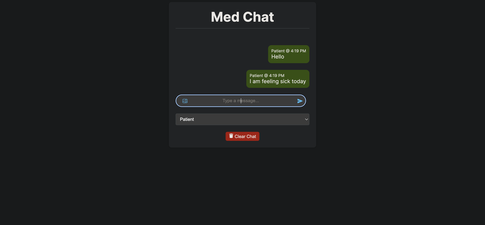
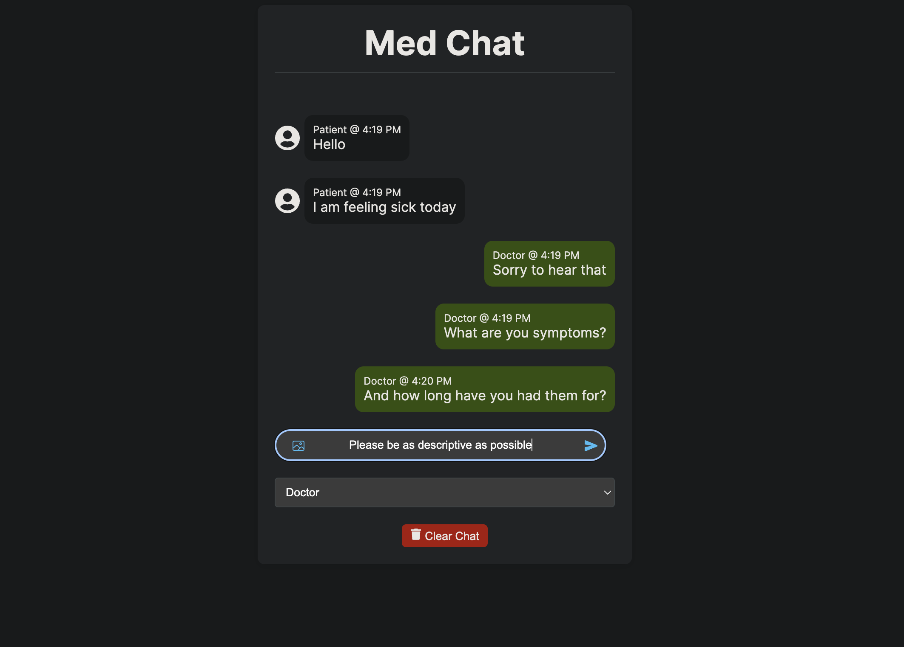

# Chat App 📱💬

Welcome to the Med-Chat App, a real-time messaging application built with Next.js and styled-components. This application allows patients and doctors to send messages instantly and view them as they come in, as well as to clear existing messages. User can switch between patient and doctor perspectives which modifies the UI. All messages are stored in the backend via Supabase. Image upload functionality is in the works 🔨🔨

## Technologies Used 🛠️

- **Next.js**: The React framework for production.
- **Styled-components**: For styling our components.
- **Supabase**: As the backend service to manage users and store messages.
- **React Icons**: For adding icons to the UI.

### Installation

1. **Clone the repository:**

   ```bash
   git clone https://github.com/leo-dao/med-chat.git
   cd med-chat

2. **Install dependencies:**
    ```bash
    npm install

3. **Set up environment variables:**
Fill in Supabase credentials in a .env.local file at the root of the directory:
    ```bash
    NEXT_PUBLIC_SUPABASE_URL=yourURL
    NEXT_PUBLIC_SUPABASE_ANON_KEY=yourKEY


4. **Run the development server:**
    ```bash
    npm run dev

Open http://localhost:3000 with your browser to see the result.


Examples of the app's functionalities: 




